# Active Directory & Wazuh SIEM Home Lab: Attack and Detection

## Table of Contents
- [Project Overview](#-project-overview)
- [Architecture & Prerequisites](#-architecture--prerequisites)
- [Step 1: Base VM Installation](#-step-1-base-vm-installation)
- [Step 2: Windows Server Configuration](#-step-2-windows-server-configuration)
- [Step 3: Active Directory Installation & Promotion](#-step-3-active-directory-installation--promotion)
- [Step 4: Joining the Client to the Domain](#-step-4-joining-the-client-to-the-domain)
- [Step 5: Deploying the Wazuh Agents](#-step-5-deploying-the-wazuh-agents)
- [Step 6: Attack Simulation & Detection](#-step-6-attack-simulation--detection)

---

## Project Overview
This project demonstrates the construction of an enterprise-grade Active Directory environment monitored by a Wazuh SIEM and XDR. It serves as a practical showcase of infrastructure deployment, agent-based monitoring, and defensive analysis.

The lab utilizes VirtualBox to host a Windows Server Domain Controller, a Windows 10 Client, and a Linux-based Wazuh server. After successfully deploying the infrastructure and joining the endpoint to the domain, a simulated defense evasion attack (wiping Windows Security logs) was executed. The attack was then investigated within the SIEM to document the detection capabilities and highlight the necessity of SIEM tuning.

---

## Architecture & Prerequisites

### Hardware Requirements
Running three operating systems simultaneously requires specific hardware specs:
* **RAM:** 16GB minimum (32GB is ideal).
* **Storage:** 80GB to 100GB of free space on an SSD. 
* **Storage Strategy:** You must use VirtualBox's "Dynamically Allocated Storage" feature. This ensures a 50GB virtual drive only consumes the 15-20GB actually used by the OS.

### Resource Allocation
* **Host PC:** Retains ~6GB RAM to keep the main computer stable.
* **VM 1 (Windows Server 2022 - DC):** Assign 2GB RAM.
* **VM 2 (Windows 10 - Client):** Assign 2GB RAM.
* **VM 3 (Wazuh SIEM - Linux):** Assign 6GB RAM (Wazuh crashes with less than 4GB).
* **Attacker Machine:** Kali Linux running on a separate host PC with 8GB RAM.

### Software Stack (100% Free)
1. **Hypervisor:** VirtualBox.
2. **Domain Controller:** Windows Server 2022 Standard Evaluation ISO.
3. **Endpoint Client:** Windows 10 or 11 Enterprise Evaluation ISO.
4. **SIEM:** Wazuh Pre-packaged OVA (Ubuntu server with Wazuh pre-configured).

---

## Step 1: Base VM Installation

### 1. Wazuh Server Initialization
* Import the Wazuh OVA into VirtualBox and boot it up.
* If Wazuh does not pull an IP address on the initial boot, run this command to force it to ask the router for an IP: `sudo systemctl restart systemd-networkd`.

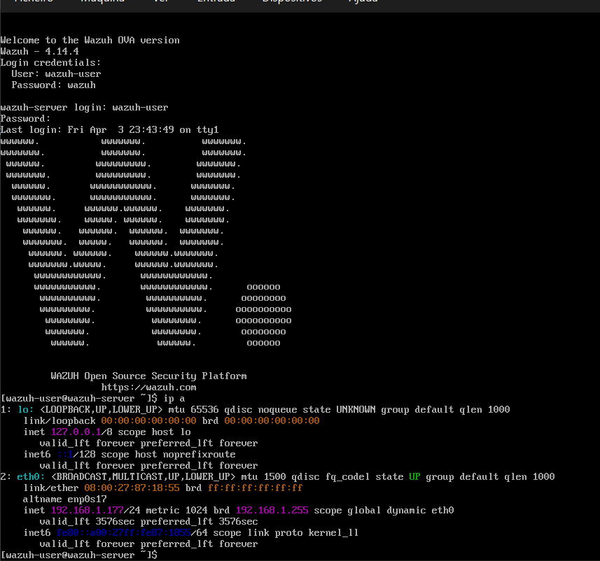

### 2. Windows Server 2022 Setup
* Create the VM using the standard VirtualBox procedure, but **unselect** "Proceed Unattended Installation" so you can manually configure it.
* In the Setup Wizard, select **Windows Server 2022 Standard Evaluation (Desktop Experience)** to ensure you get a GUI.
* Proceed with a Custom Install.
* Set the administrator password to meet enterprise complexity requirements (1 uppercase, 1 lowercase, a number, and a symbol), such as `SOCAdmin2026!`.

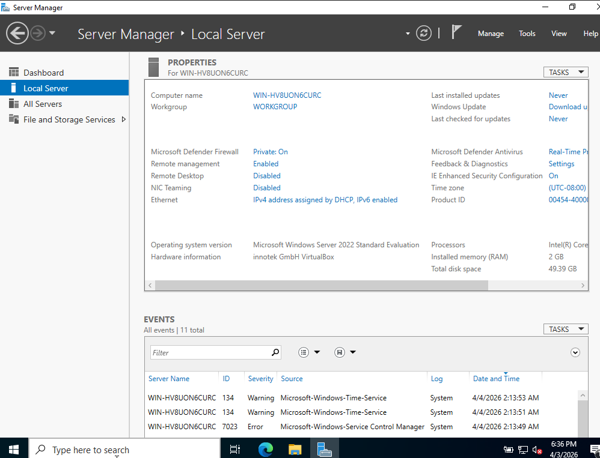

### 3. Windows 10 Client Setup
* Install **Windows 10 Pro or Enterprise** (the Home edition will not let you join a domain!!!) using the standard VirtualBox procedure.

---

## Step 2: Windows Server Configuration

### 1. Set the Static IP
* Open `cmd`, type `ipconfig`, and document your IPv4 Address, Subnet Mask, and Default Gateway.
* Locate **Network Connections**.
* Click Ethernet, then click the blue text that says **IPv4 address assigned by DHCP**.
* Right-click the network adapter and select **Properties**.
* Double-click **Internet Protocol Version 4 (TCP/IPv4)**.
* Select **Use the following IP address** and input the numbers gathered from `cmd`.
* For the **Preferred DNS server**, type `127.0.0.1` (the loopback address).
* Click OK and close the network windows.

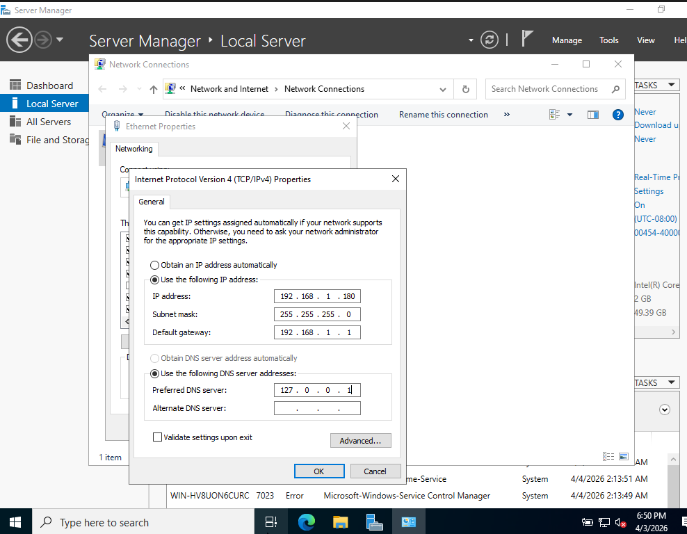

### 2. Rename the Server
* In Server Manager, click the blue generated computer name (e.g., `WIN-HV8UON6CURC`) next to **Computer name**.
* In the System Properties box, click the **Change...** button.
* Change the name to **DC01** (for easy identification later) and click OK.
* Restart the server to apply the changes (Internet access will be temporarily lost until DNS is installed).

---

## Step 3: Active Directory Installation & Promotion

### 1. Install the AD DS Role
* On the Server Manager dashboard, click **Manage** (top right) and select **Add Roles and Features**.
* Click Next three times to reach the Server Roles list.
* Check the box for **Active Directory Domain Services**.
* Click **Add Features** on the pop-up, click Next to the end, and click **Install**.

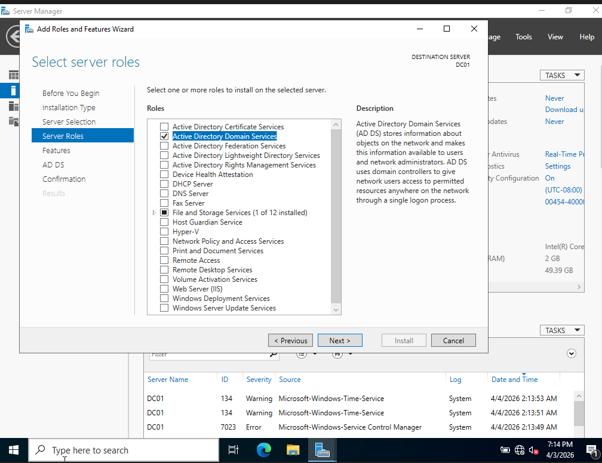

### 2. Promote to Domain Controller
* Click the yellow warning triangle at the top of Server Manager and click **Promote this server to a domain controller**.
* **Deployment Operation:** Select **Add a new forest**.
* **Root domain name:** Enter `soclab.local` (using `.local` avoids internet conflicts) and click Next.
* **DSRM Password:** Leave the functional levels on default and type in a Directory Services Restore Mode password (save it somewhere). Click Next.
* **DNS Options:** Ignore the yellow warning stating "A delegation for this DNS server cannot be created" and click Next.
* **NetBIOS:** Leave the auto-populated capital name (e.g., `SOCLAB`) and click Next.
* **Paths:** Leave Database, Log files, and SYSVOL folders on default paths and click Next.
* **Prerequisites Check:** Ignore any minor yellow warnings. Verify the green checkmark stating "All prerequisite checks passed successfully" and click **Install**.
* The server will automatically reboot. 
* Upon reboot, the login screen will change from "Administrator" to `SOCLAB\Administrator`, confirming the domain is active.

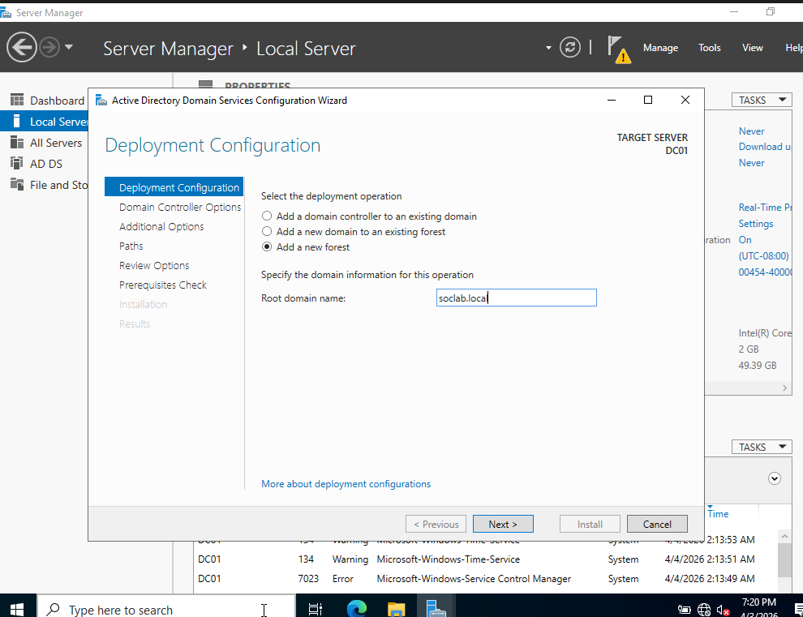

---

## Step 4: Joining the Client to the Domain

*Important: Both the Server, Wazuh and Client VMs must have their time and date synchronized with a maximum deviation of 5 minutes, or Active Directory will reject the connection.*

*Also make sure both the server and client are runnning before proceding.*

### 1. Configure the Client's DNS

By default, Windows 10 asks your home router for directions. We need to change that so it asks your Windows Server instead.

* Turn on the Windows 10 Client VM.
* In the Start search bar, type **View network connections** and hit Enter.
* Right-click the Ethernet adapter -> **Properties** -> Double-click **IPv4**.
* Leave the IP address on DHCP, but select **Use the following DNS server addresses**.
* In the Preferred DNS server box, type the IP address of your Windows Server (e.g., `192.168.1.180`). Click OK.

### 2. Join the Domain
* Click Start, type **About your PC**, and hit Enter.
* Click **Advanced system settings** -> **Computer Name** tab -> **Change...** button.
* Under "Member of", select the **Domain** bubble.

Optional: You can also change the Computer name here to something like CLIENT01.
* Type `soclab.local` and hit OK.
* A prompt will ask for credentials. Enter username `Administrator` and the Windows Server password.
* A "Welcome to the soclab.local domain" message will appear. Restart the VM.

### 3. Log In as Domain Admin
* On the login screen, notice it says **Sign in to: SOCLAB** below the password box.
* Click **Other user**.
* **User name:** Type `SOCLAB\Administrator` (the domain prefix is required to prevent logging into the local machine account).
* Type the server password and log in.

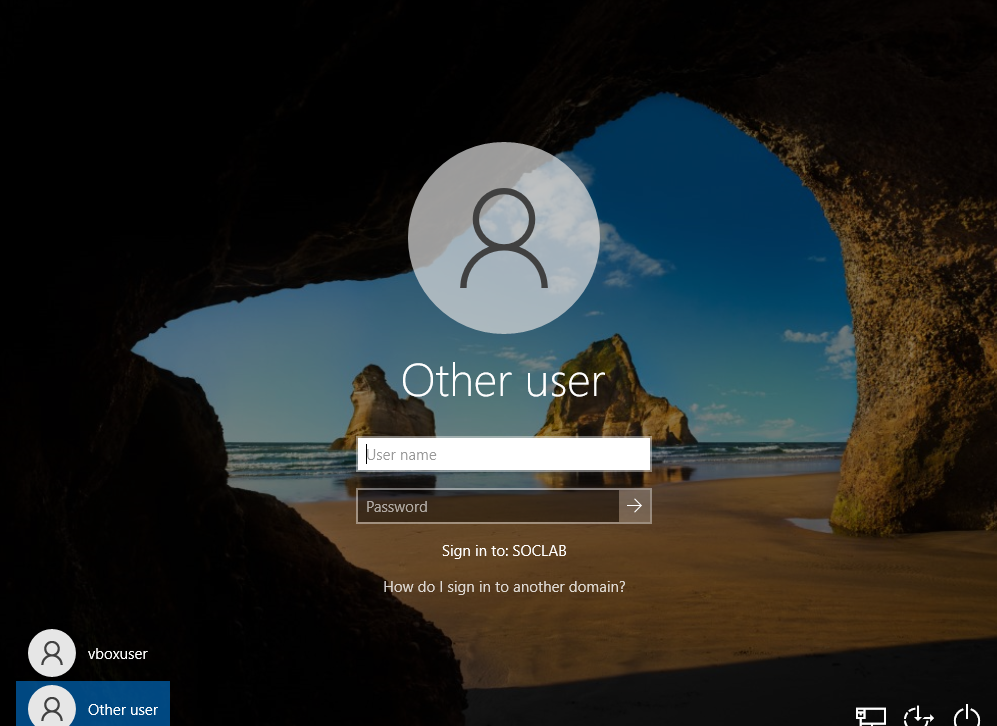
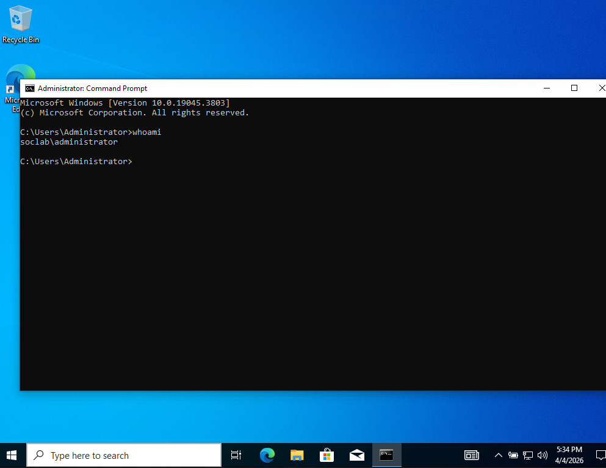

---

## Step 5: Deploying the Wazuh Agents

Wazuh acts as the SIEM interface, but we need to install an agent on the Windows machines to send logs to the server.

*All VMs should be running right now*

1. Open Microsoft Edge on the **Windows 10 Client** VM.
2. In the URL bar, type `https://` followed by the Wazuh server's IP (e.g., `https://192.168.1.50`).
3. Bypass the security warning (Advanced -> Proceed) and log in with username `admin` and password `admin`.

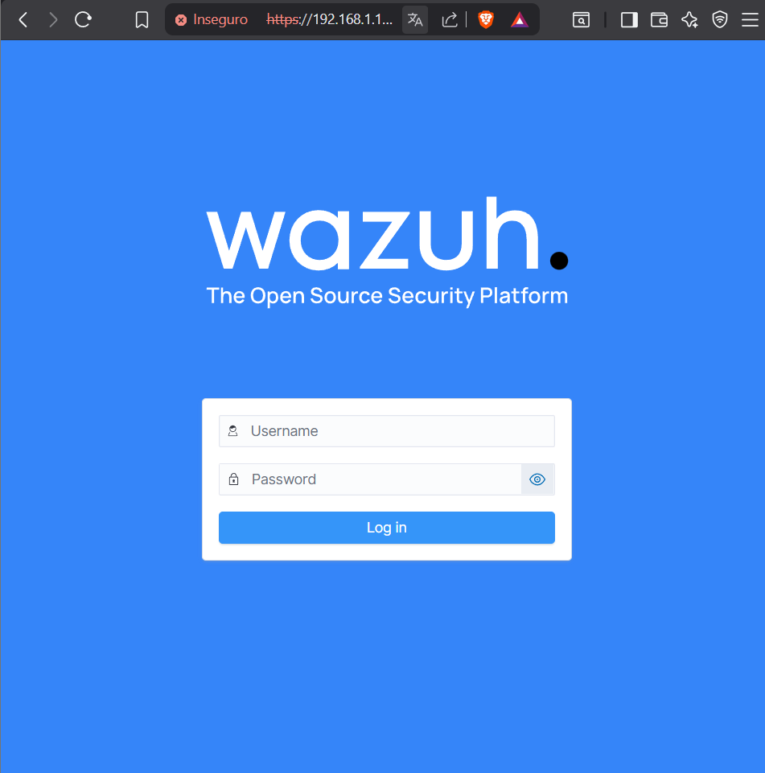

4. Click on the **Agents** section on the dashboard and click **Deploy new agent**.
5. Select **Windows** and input the Wazuh server's IP address.

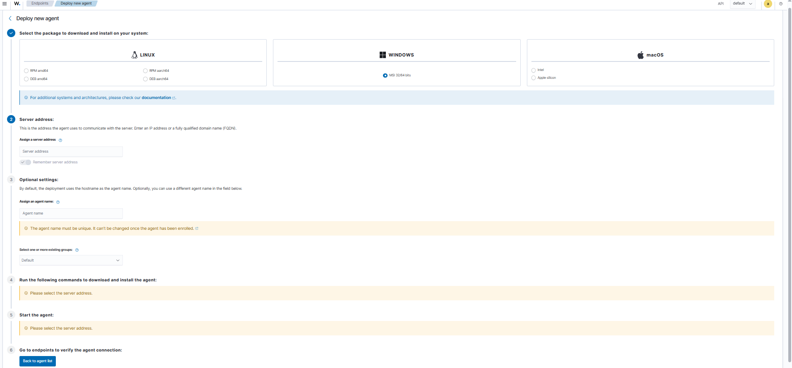

6. Copy the installation command block generated in Step 4 of the wizard.
7. Open **PowerShell as Administrator** on the Windows 10 VM.
8. Paste the command and press Enter to silently install the agent.
9. Copy the Step 5 command (`NET START WazuhSvc`), paste it into PowerShell, and hit Enter.
10. Verify the connection by going to the main Wazuh dashboard -> **Agents**. The machine should appear as **Active**.
11. Repeat this exact process on the **Windows Server** VM.

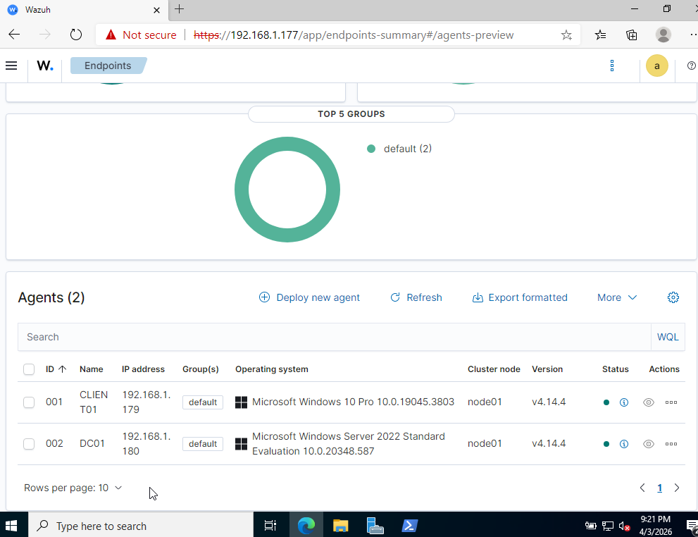

---

## Step 6: Attack Simulation & Detection

### The Attack
We will simulate an attacker attempting to cover their tracks by wiping the Windows Security logs.
1. On the Windows 10 Client, open **PowerShell as Administrator**.
2. Run the following command:
   `wevtutil cl Security`

### The Detection
1. Open the Wazuh web dashboard, click the hamburger menu, and navigate to **Discover**.

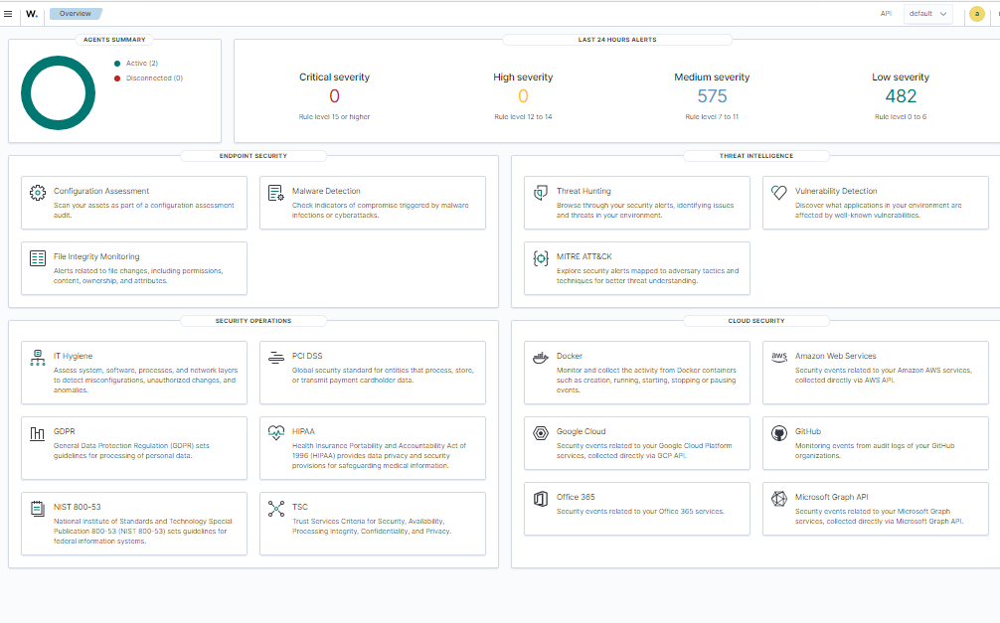

2. Search for `1102` (the Windows Event ID for cleared audit logs).
3. The log successfully captures the event, showing:
   * `agent.name: CLIENT01`
   * `Account Name: Administrator`
   * `Domain Name: SOCLAB`
   * `data.win.system.message: "The audit log was cleared."`
     
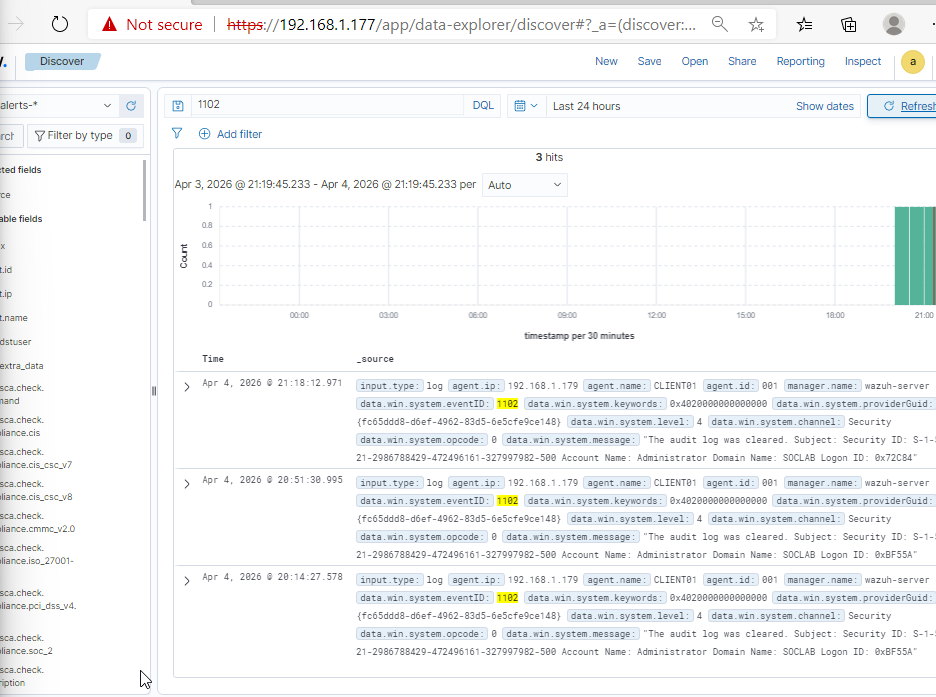

### Analysis & SIEM Tuning
**Why the command didn't show:** Searching for the specific string `wevtutil` yields zero results. Out of the box, Windows records the action (Event 1102), but not the specific command typed to execute it. To fix this blind spot, a SOC Analyst must enable the "Audit Process Creation with Command Line" Group Policy on the server.

**Why the alert was buried:** Even though the alert was generated (`wazuh-alerts-*`), it did not trigger a loud warning on the main Overview page. Wazuh scores alerts from Level 0 to 15. Out of the box, Rule ID 60106 ("Windows Audit Log Cleared") is only a Level 3 severity. It was quietly filed away with hundreds of other low-severity logs. 

To prevent attackers from slipping through, we could perform **SIEM Tuning**. We could modify the backend code to elevate this rule to a Level 12 (High Severity), ensuring future log deletions trigger an immediate investigation.
